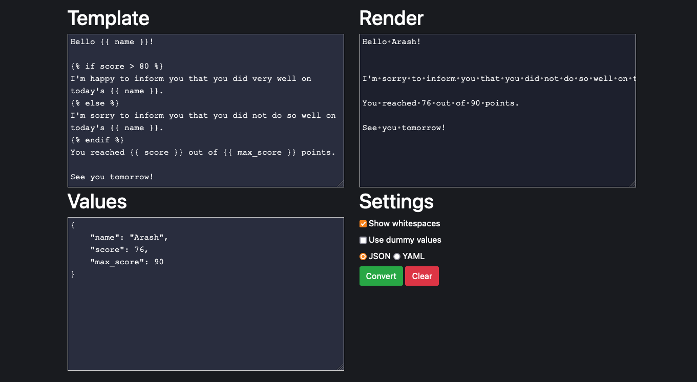

# Jinja Parser

[](https://github.com/hatamiarash7/Jinja-Parser/actions/workflows/release.yml) [](https://github.com/hatamiarash7/Jinja-Parser/actions/workflows/codeql-analysis.yml) 

It's a Live parser for Jinja2



## Install

### Local

```bash
git clone https://github.com/hatamiarash7/jinja-parser.git && cd jinja-parser
make install
make run
```

### Docker

```bash
docker run -d -p 8125:8125 hatamiarash7/jinja-parser
```

Open <http://localhost:8125>.

---

## Support 💛

[](https://donatebadges.ir/donate/Bitcoin/bc1qmmh6vt366yzjt3grjxjjqynrrxs3frun8gnxrz)

[](https://donatebadges.ir/donate/Ethereum/0x0831bD72Ea8904B38Be9D6185Da2f930d6078094)

<div><a href="https://payping.ir/@hatamiarash7"></a></div>

## Contributing 🤝

Don't be shy and reach out to us if you want to contribute 😉

1. Fork it!
2. Create your feature branch: `git checkout -b my-new-feature`
3. Commit your changes: `git commit -am 'Add some feature'`
4. Push to the branch: `git push origin my-new-feature`
5. Submit a pull request

## Issues

Each project may have many problems. Contributing to the better development of this project by reporting them. 👍
